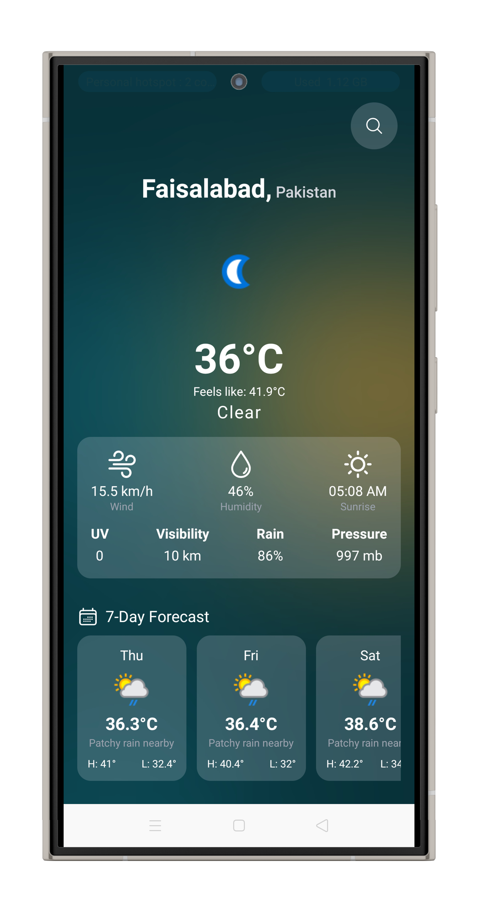
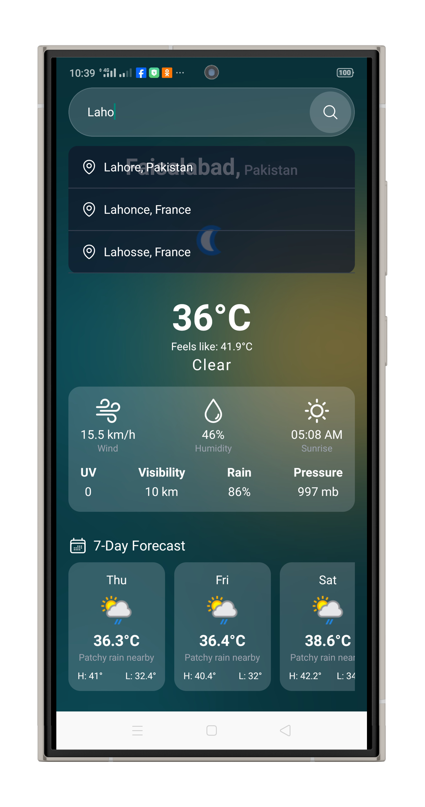

Here's your updated `README.md` tailored specifically for your **React Native Weather App**, including the added app preview image section:

---

# 🌤️ React Native Weather App

This is a beautiful and modern **React Native Weather App**, bootstrapped using [`@react-native-community/cli`](https://github.com/react-native-community/cli). It uses real-time weather data, integrates location services, and displays a 7-day forecast with elegant visuals.

---

## 📸 App Preview

<p align="center">   </p>

> Make sure you have added your screenshot to: `./assets/screenshots/weather-preview.png`

---

## 🚀 Getting Started

> **Note**: Before starting, complete the [Set Up Your Environment](https://reactnative.dev/docs/environment-setup) guide for React Native.

---

### ✅ Step 1: Start Metro

Metro is the JavaScript bundler for React Native.

```sh
# Using npm
npm start

# OR using Yarn
yarn start
```

---

### 📱 Step 2: Run the App

Open a **new terminal window** and run the following commands based on your target platform:

#### ▶️ Android

```sh
npm run android
# or
yarn android
```

#### 🍏 iOS (macOS only)

Install CocoaPods dependencies (first time or after updating native modules):

```sh
bundle install
bundle exec pod install
```

Then run the app:

```sh
npm run ios
# or
yarn ios
```

---

### 🛠️ Step 3: Modify the App

Make changes in `App.tsx` or `HomeScreen.jsx`. Thanks to **Fast Refresh**, your app updates instantly!

To **force a reload**:

* Android: Press <kbd>R</kbd> twice or <kbd>Ctrl</kbd>/<kbd>Cmd</kbd> + <kbd>M</kbd>
* iOS: Press <kbd>R</kbd> in the iOS Simulator

---

## ✨ Features

* 📍 Get weather based on **current location**
* 🔍 Search any city worldwide
* 🌡️ Real-time temperature and *feels-like*
* 🌥️ 7-day forecast
* 💧 Humidity, wind speed, sunrise time, and more
* ⚡ Elegant and responsive UI with icons

---

## 🧪 Troubleshooting

If you face issues:

* Check the [React Native Troubleshooting guide](https://reactnative.dev/docs/troubleshooting)
* Ensure your environment is properly set up per the [setup guide](https://reactnative.dev/docs/environment-setup)

---

## 📚 Learn More

* [React Native Docs](https://reactnative.dev/docs/getting-started)
* [Weather API](https://www.weatherapi.com/)
* [React Native CLI](https://github.com/react-native-community/cli)

---


